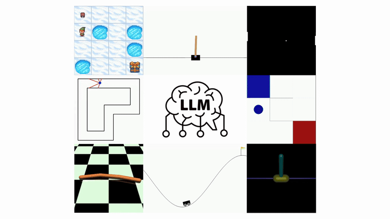

# Tutorial - Prompted Policy Search: Reinforcement Learning through Linguistic and Numerical Reasoning in LLMs

This repo serves as supporting tutorial for the paper Prompted Policy Search (ProPS and ProPS+). The project website is [here](https://props-llm.github.io/).

The `policy_optimization_tutorial` notebook goes over linear policy optimization examples for the Mountain Car Continuous Gymnasium environment, and a more complex MuJoCo Swimmer environment.

Source code for the paper is available [here](https://github.com/yfzhoucs/props-llm).
